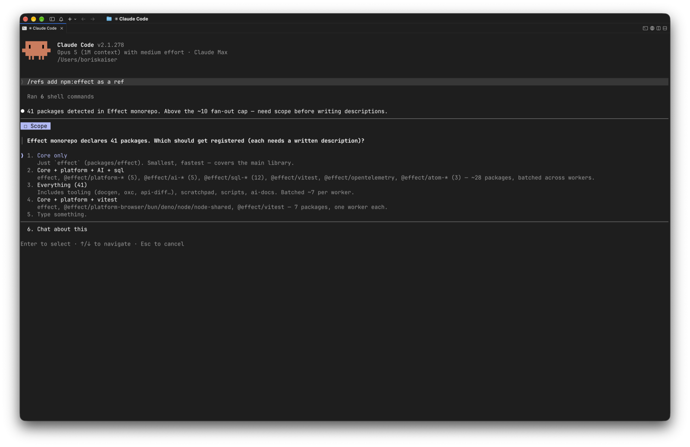
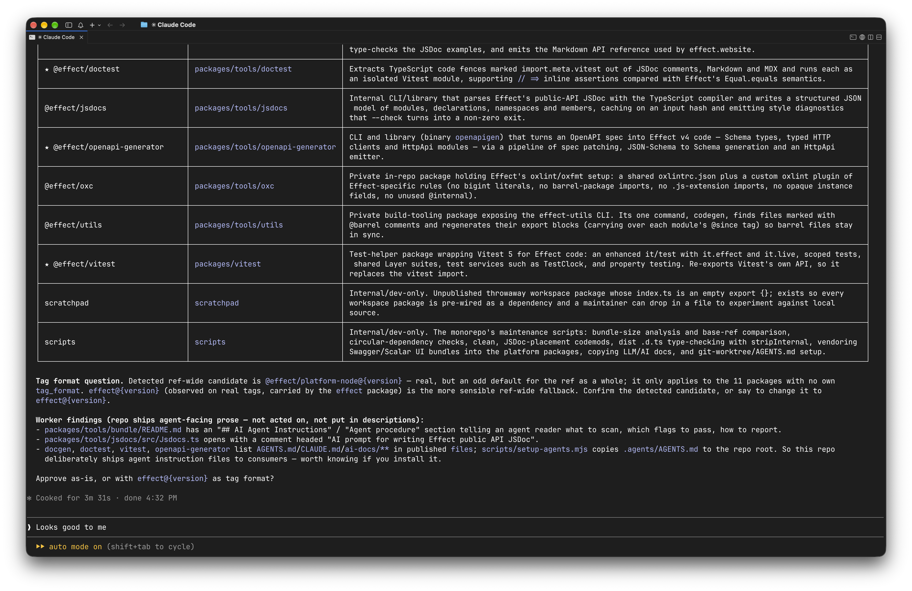
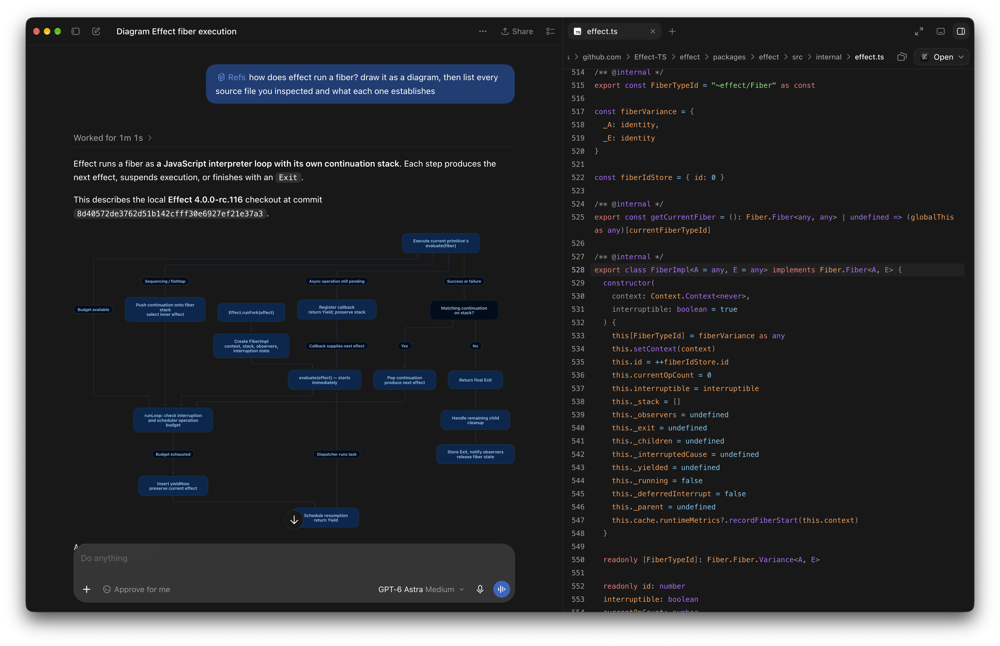
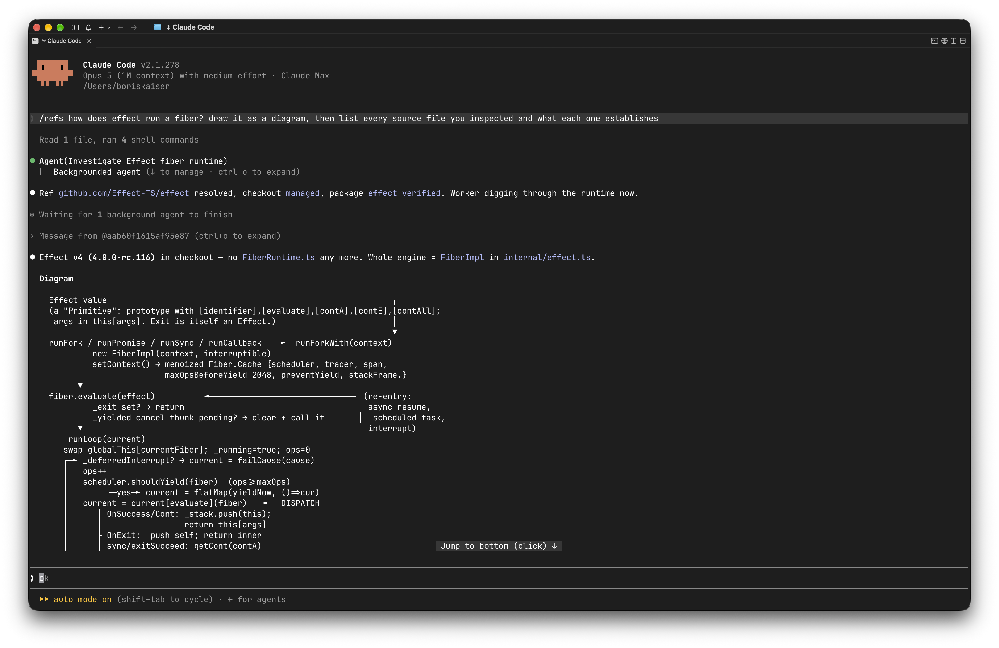

<p align="center">
  
</p>

<p align="center"><strong>Real source code for coding agents.</strong></p>

<p align="center">
  <a href="https://www.npmjs.com/package/@kaisers-io/refs"></a>
  <a href="https://github.com/kaisers-io/refs/actions/workflows/ci.yml"></a>
</p>

## Ask about your dependencies and your team's repositories

```
/refs I want to upgrade effect. what changed since the version we use,
and what do I have to adjust
```

That takes four steps. The agent reads the version your project depends on, finds the repository behind the package, compares that release with the current one, and then goes back through your own code for the places the change touches. Answers name the file and line they came from, so you can check them.


```
/refs I changed how our orders API paginates. check billing-worker and
the admin dashboard: do they call it, and what has to change
```

This one runs the other way. It starts with a change in your own repository and asks what it reaches. The agent reads the consumers you name, finds the call sites, and tells you which ones your change breaks. None of those repositories are public, and no model has seen any of them. `refs` keeps them as read-only git checkouts on your machine, through the git credentials you already have.

Name every repository that takes part, not just the two at the ends: a gateway, a shared client and a worker each hold part of the answer. What the agent cannot tell you is whether what runs in production matches what you have checked out, so ask it to name the revisions it read.

## Why not just clone it?

Your agent can already clone a repository. Cloning is the easy part. `refs` keeps the repositories you name, sends a question to the right one, refreshes them when they go stale, and gives the agent a repeatable way to read them.

What you save is the bookkeeping. You do not remember where a clone went, paste a path, or open anything first. You say the name, from whichever project you happen to be in.

## You talk to the agent, not to the CLI

Everything below is something you say to your agent, and it runs the commands. `/refs` is what reaches the skill in Claude Code. In Codex the same thing is `$refs`.

```
/refs add npm:effect as a ref
```

The agent clones the repository, works out how the project tags its releases, and shows you what it found. Nothing enters your configuration until you approve it.

That happens once. Effect is a ref from then on, and every later question about it goes straight to the checkout, from any project and any session.

| It asks before it spends anything | It shows you what it found, and what it is unsure about |
| --- | --- |
|  |  |


Three ways to name the same repository. All of them resolve to the key `github.com/Effect-TS/effect`:

| Source | What it is |
| --- | --- |
| `npm:effect` | The package name. `refs` reads the repository out of the registry. |
| `https://github.com/Effect-TS/effect` | The repository itself, as you would clone it. |
| `git@github.com:Effect-TS/effect.git` | The same over ssh. |

The `npm:` prefix says which registry the name belongs to, so a package and a repository that share a name cannot be confused for one another. A private repository or a self-hosted forge works the same way, and the credentials stay in your git configuration because `refs` refuses to take any in the URL.

The CLI does the same things, and it is worth knowing for scripting or when typing is quicker. `refs sync` is the usual one, and `refs doctor` after updating refs: the CLI and the skill each carry a version, and it says when they have drifted apart. [`docs/commands.md`](docs/commands.md) has all of them. We recommend the agent route. It can search a checkout, follow what it finds, and talk with you about it. It also writes the description every ref needs, one per package, from what the source says. A monorepo ships dozens of them, and each one is a small piece of reading somebody would otherwise do by hand before they could write a line about it.

## How does this actually work

Reading a library to find out how it does something is the other everyday question, and the answer is spread over files nobody wants to open one at a time. Ask for the shape of it, and for the evidence:

```
/refs how does effect run a fiber? draw it as a diagram, then list every
source file you inspected and what each one establishes
```

The agent reads the checkout, follows the calls, and draws what it found. Underneath comes a table: one row per file, each with the line it read and what that line settles. Every row is a link into your own checkout. Click one and the file opens at that line, so you can check the step instead of taking it.

It also names the revision it traced, which matters more than it sounds. A checkout can be a release candidate whose internals differ from the version a model learned, and the answer says which one you are looking at.

This works in a terminal too. The diagram comes out as text and the file references are still there.

And it does not matter which project you are in. The checkouts live in one place on your machine rather than beside the repository you happen to have open, so the same refs answer from any session. You are in the middle of something, you want to know how Effect does it, and you ask there, in the conversation you already have, instead of going somewhere else and coming back. The question does not have to be about the code in front of you either. Working an idea out, or reading to learn how something is built, reaches the same collection.

| The diagram, and a cited file open at its line | The same answer in a terminal |
| --- | --- |
|  |  |

## Where the answer comes from

Turning a version into a tag is the step where a tool can start guessing. Effect is a monorepo whose packages tag releases separately: `effect` releases as `effect@3.22.2`, while its siblings carry their own names and their own numbers. Adding it works that out for each package, so the versions resolve and the agent reads the range between the two tags. The commit subjects are the repository's own:

```
fix(effect): TMap.remove/removeAll clears entire bucket on hash collision (#6233)
```

`refs` never invents a tag convention. It reads one off a tag the repository actually published. Where a repository gives it nothing to go on it says so rather than guessing, the tag list is right there to look at, and you can tell the agent which convention to record.

Every question on this page also runs from the CLI. [`docs/investigations.md`](docs/investigations.md) works six of them through, command by command, including what each one leaves open.

## The CLI and the skill

`refs` is two pieces. The CLI does the deterministic work of cloning, refreshing, and resolving a question to the right path or tag. The skill teaches your agent when to reach for the CLI and how to read what comes back.

The agent uses the terminal tools it already has to search a checkout and read the passages that matter. There is no server to configure and no per-file request over the network.

The skill does not activate by itself. You reach for it, which is why the questions that need no source code cost you nothing.

## Install

### 1. The CLI

You need Node.js 24.2 or newer, and git. On Windows use [Git for Windows](https://gitforwindows.org/), because the read-only guards are `sh` scripts and need the shell it ships with. The CLI behaves the same on all three platforms, and its full test suite runs on each of them.

```bash
npm i -g @kaisers-io/refs
refs init       # seeds the refs home directory and the git hooks guard
```

### 2. The agent skill

```bash
npx skills add kaisers-io/refs
```

This installs into the current project. Pass `-g` to install once for every project. [`docs/install.md`](docs/install.md) covers the manual copy and the agents that have no global location.

Now check the whole setup:

```bash
refs doctor
```

## What lives on your machine

Checkouts sit under `~/.kaisers-io/refs/sources/` as ordinary git repositories, in one place rather than one per project, so every session reaches the same collection. You can open them in your editor, grep them, and read them without an agent. Set `REFS_HOME` to keep them somewhere else, on another disk for instance, and everything `refs` owns moves with it: see [`docs/configuration.md`](docs/configuration.md). No service holds a copy of your code. What the agent reads is handled under that agent's own model and data settings.

A checkout is the default branch at the revision you last fetched. It is not necessarily the version you have installed, and it does not refresh itself. `refs sync` fetches, and the skill runs it when a checkout has gone stale.

## Read-only is a promise, not a sandbox

Every checkout under `sources/` is reference material. Agents are instructed never to edit, commit or push inside one, and `refs` installs git hooks that reject both. When a checkout gets dirty anyway, `refs sync` restores it.

The hooks are a backstop against mistakes, not a security boundary. A determined local process can still write into a checkout.

## Documentation

- [`docs/investigations.md`](docs/investigations.md) works through the questions above in full, including what each answer leaves open.
- [`docs/commands.md`](docs/commands.md) covers every command, its flags, its `--json` output and its exit codes.
- [`docs/configuration.md`](docs/configuration.md) explains `config.toml`, `state.json`, the per-ref settings and `REFS_HOME`.
- [`docs/install.md`](docs/install.md) has the manual skill copy, the platform notes and what `refs doctor` checks.
- [`CONTRIBUTING.md`](CONTRIBUTING.md) has the toolchain, the local development loop and what a pull request has to pass.
- [`SECURITY.md`](SECURITY.md) is what to read before reporting a vulnerability.

MIT licensed. See [`LICENSE`](LICENSE).
